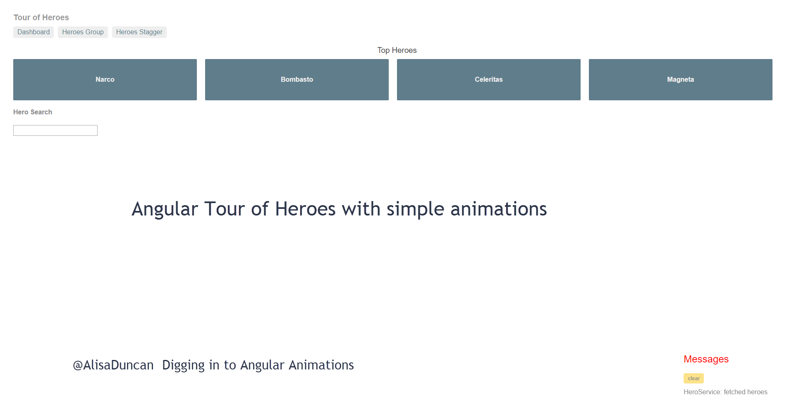

# Tour of Heroes With Animations Code

Angular Tour Of Heroes with animations added to demonstrate adding component and router animations. The code in this repo is used by [Digging in to Angular Animations](alisa.duncan.github.io/animations-presentation) presentation.

This project was generated with [Angular CLI](https://github.com/angular/angular-cli) version 8.3.4.

## Usage instructions

`git clone`
`npm install`
`npm start`

